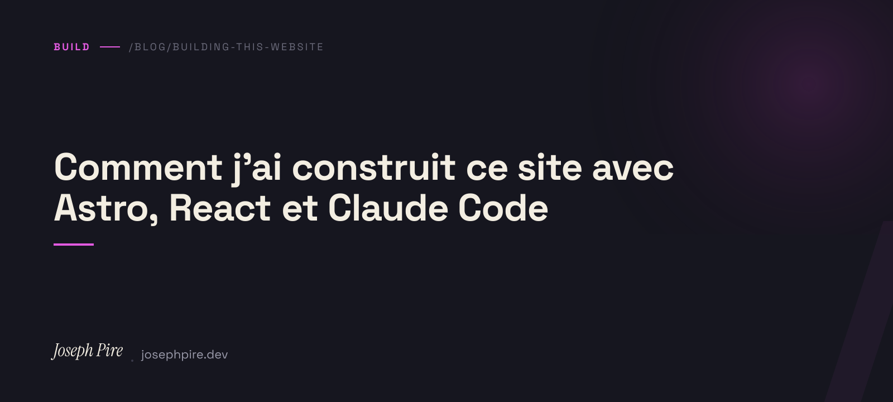

Rebuilding your own site is the project everyone postpones forever — because no client pays for it. I finally spent a few evenings on it: one on architecture, one on content, one on SEO. Here's what I chose and why.

## Astro over Next.js

I started in Next.js out of habit. After an hour, I threw it out.

The site is static. No component needs server rendering. No sessions, no paywall, no incremental revalidation. Next.js was charging me a full React runtime to deliver a blog and a portfolio.

Astro makes exactly the opposite trade-off: everything is static by default, and React components hydrate with `client:load` (or `client:visible`, or `client:idle`) **only** where interactivity demands it. On this site, that means three React islands — the nav, the contact form, the search modal — and the rest ships as HTML in under 30 kB.

Lighthouse mobile: 100 / 100 / 100 / 100. That was the goal.

## i18n without an extra framework

Three languages, FR default. Astro 6 has built-in i18n, but only for routing — for translations themselves, the choices were `i18next`, `astro-i18n`, or rolling my own.

I rolled my own. It all fits in `src/lib/i18n.ts`:

```ts
export const TRANSLATIONS = {
  fr: { nav_home: 'Accueil', /* … */ },
  en: { nav_home: 'Home',    /* … */ },
  nl: { nav_home: 'Home',    /* … */ },
} as const;

export function useLang(lang: Lang) {
  return { t: (key: string) => TRANSLATIONS[lang][key] ?? key };
}
```

No external JSON, no async loader, no weird hot-reload. 300 lines of TypeScript and the whole UI is translated. When I add a string, I add it to all three locales in the same commit — git is my safety net.

Routing follows the Astro convention: `src/pages/` serves FR, `src/pages/[lang]/` serves EN+NL via `getStaticPaths`. `<link rel="alternate" hreflang>` tags are generated in the layout, and the sitemap includes the variants via the `i18n` option of `@astrojs/sitemap`.

## Content as collections

Blog and projects live under `src/content/{blog,projects}/<lang>/<slug>.md`. Zod schema, compile-time validation, types generated automatically:

```ts
const blog = defineCollection({
  loader: glob({ pattern: ['**/*.md', '!**/_*.md'], base: './src/content/blog' }),
  schema: z.object({
    title: z.string(),
    excerpt: z.string(),
    pubDate: z.date(),
    category: z.string(),
    readTime: z.number(),
    tags: z.array(z.string()).optional(),
    draft: z.boolean().optional(),
  }),
});
```

The `!**/_*.md` excludes templates (`_template.md`) that I use as a skeleton when starting a new project. Without that filter, they'd crash the build at validation.

## SEO: what actually matters

Lighthouse checklists are a distraction. To rank, you need:

1. **A clean sitemap with hreflang** — done by `@astrojs/sitemap`, which emits `xhtml:link` for each URL.
2. **A global `WebSite` JSON-LD** — eligible for the sitelinks search box.
3. **`Person` + `ProfessionalService` JSON-LD on the homepage** — tells engines you're a real person and a real business, with `areaServed`, `priceRange`, `contactPoint`.
4. **`Article` + `BreadcrumbList` JSON-LD on each post** — what you're reading right now, at the bottom of the HTML.
5. **`FAQPage` JSON-LD on the Services page** — near-guaranteed rich snippet if the questions are relevant.
6. **A per-post OG image**, generated dynamically with Satori — big CTR boost on LinkedIn and X.

And above all: correct **canonical URLs**, correct **alternates**, correct **ISO dates**. Eighty percent of SEO bugs come from silly mistakes in the headers.

## Performance

Three levers, in order of impact:

- **Self-hosted fonts** via `@fontsource`. No `fonts.googleapis.com`, no third-party DNS lookup, no FOIT.
- **Built-in image optimization**: portfolio images live in `src/assets/projects/<slug>/` and are referenced with a relative path. Astro emits WebP with intrinsic width/height. On this site, **5.8 MB of PNGs got compressed down to 780 kB of WebPs**.
- **`<ViewTransitions />`**: navigation is animated natively, but more importantly, the nav and the search modal are marked `transition:persist`, so their state (scroll, query) survives navigation.

## Search

[Pagefind](https://pagefind.app). Zero runtime at load, post-build indexing, ~150 kB index for 24 pages × 3 languages. The modal opens with ⌘K (or `/`) and lazy-loads `/pagefind/pagefind.js` on first open.

```ts
const mod = await import(/* @vite-ignore */ url);
await mod.init();
```

The `@vite-ignore` is mandatory — otherwise Rollup tries to resolve the import at build time and fails.

## Claude Code in the loop

I wrote almost all the SEO, i18n and search modal in pair with [Claude Code](https://claude.com/claude-code). Not in "generate me a site" mode — in "here's the structure I want, validate the choices, write the code, show me the diff" mode. The result holds up better than what I'd have written solo, because I had a tireless partner challenging the small things (like: "why are you hardcoding `https://josephpire.dev` when Astro has `Astro.site`?").

I'm writing a separate post on my Claude Code setup and the plugins I actually use.

## Wrapping up

A few evenings of work. A clean Lighthouse score, tight SEO, three languages, and a blog I can finally use to write **this**. That's enough.

The code is readable on [GitHub](https://github.com/iq0boy) — if anything catches your eye, drop me a line.
