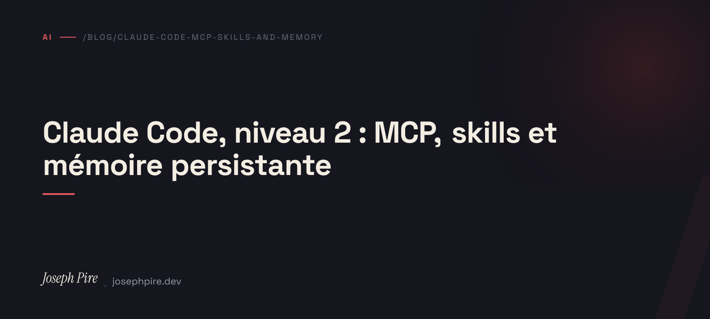

In [my first Claude Code post](/en/blog/claude-code-workflow) I covered the basics: installation, the three starter plugins, the default workflow. Six months on, my setup has grown a lot — and it's the layers I hadn't covered that make the real difference now. Four of them: **MCP** servers, the **skills** system, **persistent memory**, and **sub-agents**.

Every example below comes from real work on this site and my client projects.

## TL;DR

A bare Claude Code is a good pair programmer. Wired to MCP servers (my Obsidian vault, the browser, up-to-date docs), fed by skills that enforce a method, given memory that survives sessions, and able to delegate to sub-agents in parallel, it becomes a colleague that knows my context and my habits. The cost: setup, and the discipline to keep it all honest.

## MCP servers: giving Claude hands

The **Model Context Protocol** is an open standard that lets Claude Code talk to external tools through servers. In practice, each MCP server adds a bundle of tools Claude can call the same way it calls `Read` or `Bash`. Three I use daily:

**Obsidian.** My notes vault (clients, projects, freelance admin) is exposed via the Local REST API plugin. Claude reads, searches, and writes in it directly. When I finish a work session on a client project, it documents what was done in the right note, with the right `[[wikilinks]]` — without me leaving the terminal. This site's note and the client project notes stay current as a side effect of the work, not as a separate chore.

**Chrome DevTools.** A server that drives a real browser: navigate, click, take screenshots, read the console, run a Lighthouse audit. That's how I illustrate my portfolio case studies — Claude runs the project locally, captures the real pages, and inserts them into the Markdown. No more manual screenshots to crop.

**Context7.** Fetches up-to-date library docs the moment they're needed. A model's training data always has a horizon; Context7 fills the gap for APIs that moved recently. I invoke it whenever I touch a lib I don't know well or whose version has changed.

> The rule I set myself: an MCP server has to earn its place. Each one widens the attack surface and the context loaded. Three well-chosen beat ten out of curiosity.

## Skills: method, not just answers

A **skill** is a bundle of instructions Claude loads on demand when the task matches. The difference from a plain prompt: a skill enforces a *way of working*, not just a result.

The `superpowers` plugin ships a whole library of them. The ones I actually use:

- **`brainstorming`** — before any creative work, it grills me on intent and constraints. One question at a time, until the need is sharp.
- **`systematic-debugging`** — facing a bug, it reproduces, minimises, forms a hypothesis, instruments, *then* fixes. It stops me jumping straight to the plausible-but-wrong patch.
- **`test-driven-development`** — red-green-refactor, strict discipline. On business logic, that's non-negotiable.
- **`writing-plans`** then **`executing-plans`** — for tasks that outlast a session, a written plan I review before a line of code is produced.

The thing that changes everything: these skills override the model's default behaviour, **but my own instructions come before the skills**. A `CLAUDE.md` that says "no TDD here" wins over a skill that preaches TDD. The hierarchy is clear: me, then skills, then the model.

## Persistent memory: not re-explaining your context

By default, every session starts from scratch. Two mechanisms fix that.

**Background memory.** Claude keeps memory files — who I am, my working preferences, project decisions you can't derive from the code. Over sessions, it stops re-asking what it should already know: my default stack, my tone, the fact that I freelance on the side.

**Session handoffs.** A `SessionStart` hook automatically reloads a state memo left by the previous session (`.remember/`). At the end of the day, the `remember` skill writes what was done, what's left, and the traps hit along the way. The next day I don't start cold — the next session knows where we were.

That's exactly what makes a string of sessions coherent: this post, the case studies, the Lighthouse budget in CI — each step was picked up by the next session without me re-explaining the context.

## Sub-agents: delegating in parallel

The real recent productivity jump is **sub-agents**. Claude can launch specialised agents in parallel, each with its own context, and pull back only the conclusion.

A concrete example from this site: to deepen my portfolio case studies I needed *verified* facts — not invented ones — on three client projects. Rather than dig through each repo by hand, three `Explore` agents were launched at once, one per project. Each mined its repo (Git history, dependencies, README, pain points in the commits) and handed back a factual report. I wrote the case studies from those reports — with real numbers: commit count, duration, build size, page count.

For more structured tasks, the **Workflow** tool orchestrates agents deterministically — fan-out for broad coverage, adversarial verification before concluding. The "main agent + N specialists" pattern saves hours on big refactors and exhaustive reviews.

The caveat: a sub-agent hands you text, not a diff you've read. I always treat their output as a *source to verify*, never as settled truth — especially when it's headed for publication.

## The honest workflow

My default loop today:

1. **Context loaded for me** — memory + yesterday's handoff at startup.
2. **`/brainstorming`** on real features; direct implementation on small ones.
3. **Parallel delegation** when the work splits cleanly (research, repo mining, multi-angle review).
4. **Read every diff.** Non-negotiable. Sub-agents and MCP widen what I delegate, not what I rubber-stamp.
5. **`/commit`** when green, **`/code-review`** before merge.
6. **`remember`** at the end of the session for the next one.

## Trade-offs

All of this has a cost. More MCP servers = more surface and more context loaded each turn. Memory can go stale: a note saying "flag X exists" turns false when the flag is removed — I verify before relying on it. And parallel delegation burns tokens fast; I reserve it for tasks that genuinely justify it.

The underlying trap is the same as in the first post: **delegating is not abdicating.** The more powerful the tooling, the more tempting it is to validate in batch. That's exactly where the sneaky 5% of errors slip through.

## Takeaway

If you already have the Claude Code basics, add *one* layer this week: wire up a single MCP server useful to your real work (for me it was Obsidian) and use it on a real task. You'll feel the difference immediately between an assistant that answers and a colleague that knows your context. The rest builds on top.
