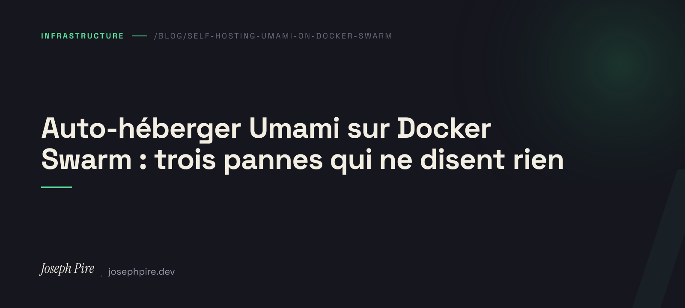

Deze site had helemaal geen meting. Niet "onvolledige meting": geen. Ik publiceerde artikelen zonder te weten of iemand ze las, en optimaliseerde Core Web Vitals zonder te weten welke pagina ertoe deed.

Dat is opgelost: Umami draait nu op mijn eigen machine, achter Caddy, zonder cookies en dus zonder toestemmingsbanner. De uitrol zelf is saai — één compose-bestand, één `make deploy`. Wat het opschrijven waard is, zijn de **drie storingen die geen enkele foutmelding geven**.

## TL;DR

Umami 3.3.1 + Postgres als Docker Swarm-stack, gerouteerd door `caddy-docker-proxy` via labels. De hele stack gebruikt in rust **220 MB**. De drie valkuilen: `depends_on` wordt genegeerd door `docker stack deploy`, het wachtwoord-endpoint dat elke oudere gids noemt geeft 404 terwijl de standaardgegevens actief blijven, en een CSP die maar de helft van de beacon toestaat levert een leeg dashboard zonder console-fout.

## Eerst een correctie: dit was nooit een RAM-probleem

Ik stond op het punt het omgekeerde artikel te schrijven. "Plausible past niet op mijn kleine VPS, dus Umami." Dat was onjuist, en ik ontdekte het pas door de machine echt te bekijken.

Plausible Community Edition heeft **PostgreSQL én ClickHouse** nodig. ClickHouse is een kolomdatabase gebouwd voor analytics op schaal; in rust reserveert die vlot enkele honderden megabytes. Ik had "VPS van 5 €" in mijn hoofd, de formulering uit [mijn eigen artikel daarover](/nl/blog/why-a-vps-and-how-to-set-it-up), en had daaruit een beperking afgeleid die niet bestond. Zelfs dubbel: de Hetzner CX22 die ik daar aanraad voor 4,51 € heeft **8 GB RAM**, genoeg om ClickHouse zonder drama te dragen. En mijn eigen machine is sowieso geen CX22.

De echte machine:

```
Debian 13 · 15 GiB RAM (7,3 GiB beschikbaar) · 8 vCPU · 150 GB
~28 containers draaien er al
```

Plausible had er moeiteloos op gepast. **De keuze voor Umami is dus geen beperking maar een voorkeur** — en dat zeg ik liever dan het te verkleden als technische noodzaak. Eén database in plaats van twee, op een machine die al 28 containers draait. Een OLAP-engine om de bezoeken van een portfolio te tellen is een bewegend onderdeel dat je moet back-uppen, migreren en repareren, voor een volume dat in een spreadsheet past.

> Controleer de machine vóór je het argument schrijft. De beperking die je aanhaalt bestaat misschien niet.

## De stack

Niets exotisch. Twee services, Caddy-labels, geen Caddyfile:

```yaml
services:
  umami:
    image: docker.umami.is/umami-software/umami:3.3.1
    env_file: [.env]
    environment:
      DATABASE_URL: postgresql://umami:${POSTGRES_PASSWORD}@db:5432/umami
    networks: [edge-swarm, internal]
    deploy:
      replicas: 1
      update_config:
        order: start-first
      restart_policy:
        condition: on-failure
        delay: 5s
      labels:
        caddy: ${UMAMI_DOMAIN}
        caddy.reverse_proxy: "{{upstreams 3000}}"

  db:
    image: postgres:17-alpine
    volumes: [umami_db_data:/var/lib/postgresql/data]
    # Bewust niet op edge-swarm: de database is alleen bereikbaar
    # vanuit de app, nooit vanaf de edge.
    networks: [internal]
```

`caddy-docker-proxy` leest de labels, regelt het certificaat, klaar. De app is stateless en heeft geen hostpoort, dus `start-first`: de nieuwe taak komt op vóór de oude verdwijnt, geen downtime bij een redeploy. De database, één schrijver op een lokaal volume, blijft `stop-first`.

## Stille storing #1: `depends_on` doet niets

Het bestand ziet eruit als Docker Compose, dus schrijf je uit gewoonte `depends_on: [db]`. **`docker stack deploy` negeert dat volledig.**

Bij een koude start kan de app dus opstarten voordat Postgres verbindingen accepteert, falen en afsluiten. Wat de stack doet convergeren is niet de startvolgorde maar het `restart_policy`. Een paar herstarts in de eerste seconden is *normale werking*, geen incident.

De valkuil is niet de storing — die herstelt zichzelf. Het is een half uur debuggen aan een volkomen gezonde database.

## Stille storing #2: het spookendpoint dat het standaardwachtwoord laat staan

Dit is het enige echte beveiligingslek van de drie, en het is een gemene.

Umami maakt een account `admin` / `umami` aan. Het dashboard staat op een publiek domein **vanaf het moment dat Caddy het certificaat uitgeeft**. Dat is niet theoretisch: vanaf een andere machine, buiten de server, gaf een verzoek aan `/api/auth/login` met die gegevens mij een geldig sessietoken.

Dus verander je het wachtwoord. De meeste gidsen zeggen:

```bash
# ❌ geeft 404 op v3 — en verandert niets
POST /api/users/{userId}/password
```

Dat is het pad van eerdere versies. Op v3 is het juiste:

```bash
# ✅
TOKEN=$(curl -sS -X POST https://$DOMAIN/api/auth/login \
  -H 'Content-Type: application/json' \
  -d '{"username":"admin","password":"umami"}' | jq -r .token)

curl -sS -X POST https://$DOMAIN/api/me/password \
  -H "Authorization: Bearer $TOKEN" -H 'Content-Type: application/json' \
  -d '{"currentPassword":"umami","newPassword":"<nieuw>"}'
```

Het gevaar is niet de 404. Het is wat je eruit concludeert: "vreemd, die aanroep mislukte", je gaat verder, en het standaardwachtwoord blijft **actief op een publiek beheerpaneel**. De fout lijkt een technisch detail terwijl het een open deur is.

Vandaar de enige regel die hier telt: **controleer niet of de wijziging is gelukt, controleer of de oude is gestopt met werken.**

```bash
# moet 401 geven. Elke andere code betekent dat de deur nog openstaat.
curl -o /dev/null -w '%{http_code}' -X POST https://$DOMAIN/api/auth/login \
  -H 'Content-Type: application/json' \
  -d '{"username":"admin","password":"umami"}'
```

Nu we toch in dezelfde familie valkuilen zitten: v3-images op het officiële register gebruiken **kale semver** (`3.3.1`). Het `postgresql-`-voorvoegsel dat iedereen overneemt is de oude v1/v2-naamgeving, nog gepubliceerd op ghcr.io — dat bij v2.x stopt. Pin `3.3.1`, niet `postgresql-latest`.

## Stille storing #3: de half toegelaten beacon

Deze site serveert een strikte Content-Security-Policy die inline scripts toestaat op hash in plaats van `'unsafe-inline'`. Een analytics-beacon toevoegen vraagt **twee** toestemmingen, niet één:

```
script-src  … https://stats.example.com   ← laadt /script.js
connect-src … https://stats.example.com   ← POST van elk bezoek naar /api/send
```

Er maar één zetten is de duurste fout van de drie, want het lijkt op niets. De site werkt. Geen zichtbare console-fout. Core Web Vitals ongemoeid. Het dashboard is simpelweg leeg — en dat merk je drie weken later, terwijl je je afvraagt of er wel iemand langskomt.

Omdat ik mijn eigen oplettendheid hierin niet vertrouw, heb ik het geautomatiseerd. De controle haalt de origin op van **elk** `<script src="https://…">` in de gebouwde HTML en laat de build falen als die ontbreekt in `script-src`:

```js
const scriptSrc = csp.match(/script-src ([^;]+)/)?.[1] ?? '';
for (const origin of externalScriptOrigins()) {
  if (!scriptSrc.includes(origin)) {
    problems.push(`${origin} wordt geladen maar ontbreekt in script-src — het zou stil geblokkeerd worden`);
  }
}
```

Een browsertest bevestigt daarna, tegen de echte policy, dat `script.js` laadt en dat het verzoek naar `/api/send` het netwerk daadwerkelijk bereikt.

## De slotironie: het instrument dat de meting vertekent

Het eerste wat de meting me leerde, is dat mijn eigen verificatietest neppe bezoeken in het dashboard injecteerde.

Mijn test onderschepte `/api/send` zodat er niets zou worden vastgelegd. Alleen verstuurt Umami via **`navigator.sendBeacon()`**, wat de netwerkonderschepping van Playwright niet vangt. Betrapt door te tellen: 9 bezoeken vóór de run, 11 erna.

De oplossing gebruikt het mechanisme dat Umami zelf biedt in plaats van een onderscheppingstruc — zet de tracker bij de bron uit:

```js
await ctx.addInitScript(() => {
  try { localStorage.setItem('umami.disabled', '1'); } catch {}
});
```

Daar zit een bredere les in, en die reikt verder dan Umami: **een instrument is onderdeel van het systeem dat het meet.** De enige manier om het te weten was tellen vóór en na.

## Afwegingen

Je wordt zelf de wachtdienst. Valt Postgres uit, dan zijn de bezoeken van die nacht weg — het script faalt stil aan de clientkant, de site heeft er nooit last van, maar de data komt niet terug. Umami Cloud bestaat, en het is geen afzetterij: het is de eerlijke prijs om geen wachtdienst te hebben.

Ik host zelf omdat de machine toch al draait en de data bij mij blijft. Is dat jouw situatie niet, dan is de gehoste versie waarschijnlijk de juiste keuze.

En het moet gezegd: Umami is armer dan Plausible. Minder afwerking, ruwere rapporten. Voor een portfolio is de vraag die telt "welke pagina's worden gelezen en waar komen mensen vandaan", en dat beantwoordt het.

## Om mee te nemen

Rol je deze week Umami uit, doe dan de drie controles die je niet ziet:

1. `POST /api/auth/login` met `admin`/`umami` moet van buitenaf **401** geven.
2. Laad na het toevoegen van de beacon de site en bevestig dat een bezoek **echt** in het dashboard landt — niet alleen dat de pagina rendert.
3. Heb je een CSP, controleer dan `script-src` **én** `connect-src`.

Alle drie falen ze in stilte. Geen enkele zal het je vertellen.
