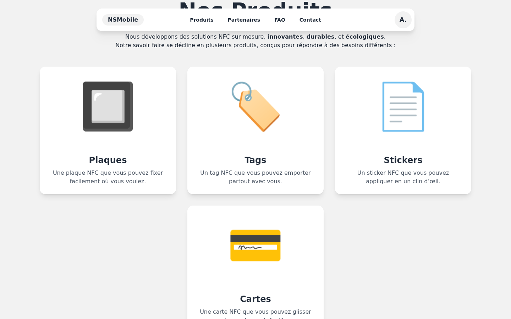

Carder is a multi-tenant SaaS for NFC business cards, deployed under `nsmobile6k.be` and `techcard.be`. Each client gets a fully customised `/users/[slug]` page — logo, colours, links, badges — accessible with a single tap on any NFC-enabled smartphone.


## Architecture

Built with **Astro 5 SSR** on the standalone Node.js adapter. Persistence is **Astro DB** (hosted SQLite via libSQL), queried with **Drizzle ORM**. Interactive bits are **React 19**; the UI uses **Tailwind + DaisyUI** for base theming and inline CSS variables for per-card colours. Mutations go through **Astro Actions** rather than ad-hoc API routes — type-safe end to end and validated by **Zod**.

```
Node.js (entry.mjs)
    │
    └── Astro SSR runtime
            ├── Public pages       /users/[slug], /users/[slug]/badges/[id]
            ├── User dashboard     /cards, /cards/[slug]/edit, /profile
            ├── Admin panel        /admin/cards, /admin/access
            └── Astro Actions      CRUD for cards, links, badges, auth
```

Sessions use Astro's experimental `fs-lite` driver, persisted in a dedicated Docker volume.

## Product range

The customer-facing landing markets four physical NFC supports — plaques, tags, stickers and cards — all backed by the same card record on the platform.



## Admin panel

Admins create card slugs, manage assets and prune the catalogue from a single dashboard. Each card has its own `/cards/[slug]/edit` form where the client (or the agency on their behalf) configures everything below.


## Per-card customisation

Each card exposes a set of configurable properties:

- **Colours** — card background, text, logo background, link colours: all injected as inline styles for accurate per-client rendering without global CSS overrides.
- **DaisyUI theme** — applied via `data-theme` for per-client light/dark mode.
- **Border radius** — `rounded` or `square` style driven by the `theme` field.

## Link system

A card can display up to **8 links** in a 2-column grid. Each link has one of 20+ types — phone, WhatsApp, Instagram, TikTok, Google Maps, Google reviews, menus, online ordering, calendar, forms, and more. The `size` property (`small` / `large`) controls whether the link spans 1 or 2 columns.

## Badges

Badges are visual buttons tied to an image or logo, with an optional URL or a dedicated sub-page at `/users/[slug]/badges/[id]`. Clients use them to showcase certifications, current promotions, menus or rich media content directly on the card.


## Installable PWA

Each card page dynamically generates an inline **Web App Manifest** — `id`, `start_url`, `scope`, theme colours and icons are all computed from the card's database record. End users add the card to their home screen without going through any app store; the page launches in `fullscreen` mode with no browser chrome, which keeps the experience indistinguishable from a native app for repeat visits.

## Cookieless analytics

Page views and clicks are tracked through an internal service (`holmes.nsmobile.be`). Every event — page load or link/badge click — fires a `POST /api/hits/[slug]/[action]`. No cookies, no third-party JavaScript, no consent banner needed.

## Deployment

The application runs on **Docker Compose** behind a **Caddy** reverse proxy configured via container labels. Two volumes are mounted: `data/` for sessions and the local SQLite database, and `dist/client/assets/cards/` for card assets (logos, badges) persisted across image rebuilds.
