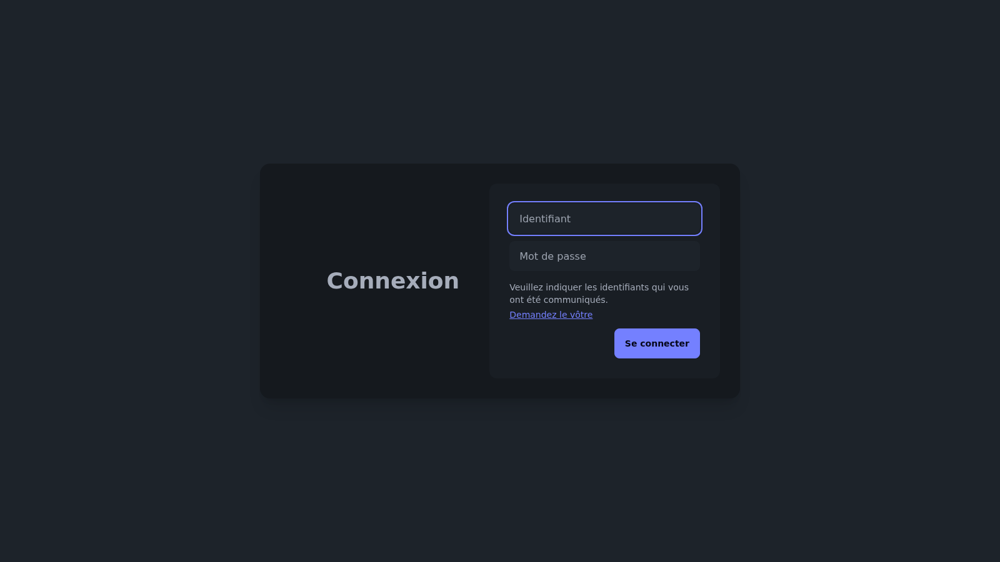

Holmes is the in-house analytics service for the Carder NFC card platform. It exposes a public `POST /api/hits/:client_id/:action_id` endpoint consumed by every card page to track views and clicks on links or badges — no cookies, no third-party scripts.



## Architecture

The application is written entirely in **Go 1.23**. The structure follows a classic layered design, wired together by dependency injection via **Uber fx**.

```
main.go  (fx.New → DI container)
    │
    ├── Config      (Viper — app.env + cors.yaml)
    ├── Database    (GORM + SQLite)
    ├── Service     (business logic)
    ├── Middleware  (session auth: admin / customer)
    └── Handler     (Echo routes)
```

HTML templates are generated with **Templ** — a compiler that turns `.templ` files into typed Go functions, with no string concatenation and no `html/template` at runtime.

## Hit Tracking

The core of the service is a minimal upsert:

1. `UPDATE Views SET Count = Count + 1 WHERE client_id = ? AND action_id = ? AND month = ? AND year = ?`
2. If `RowsAffected == 0`, `INSERT` a new row with `Count = 1`

Each entry is scoped to `(client_id, action_id, month, year)`. Read queries aggregate with `SUM(Count) GROUP BY client_id, action_id` to consolidate totals over a period.

## Dashboard

Two access levels protected by **Gorilla Sessions**:

- **Admin** — global view across all clients, sorted by descending hit volume
- **Customer** — view restricted to the slugs linked to the logged-in account

The month/year filter in the dashboard is an htmx-boosted form: partial reloading avoids a full-page refresh without adding custom JavaScript.

## Configuration

Allowed CORS origins are declared in `config/cors.yaml`, hot-reloaded via **Viper** + `fsnotify`. Secrets (admin password, cookie key) are injected from an `app.env` file at startup, with an explicit panic if `COOKIE_SECRET` is missing.

## Deployment

The Docker image runs on the same Swarm network as Carder, behind **Caddy** (`holmes.nsmobile.be`). The SQLite database is persisted in a bind-mounted `./database` volume. A **GitHub Actions** pipeline builds and deploys the image automatically on every push to the main branch.
