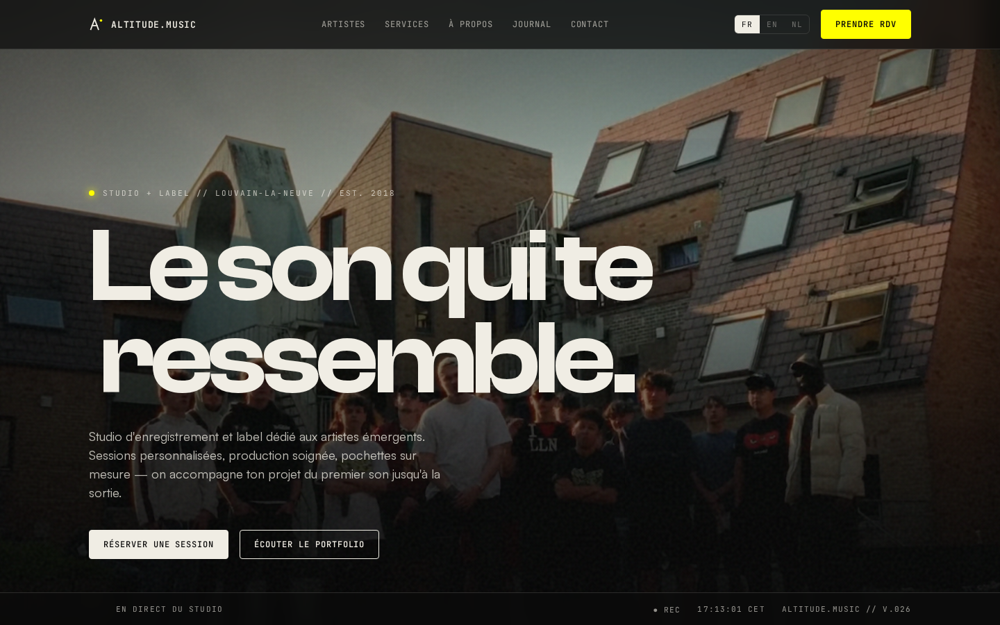
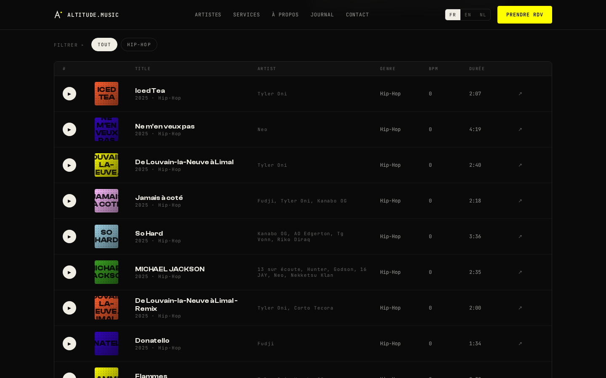
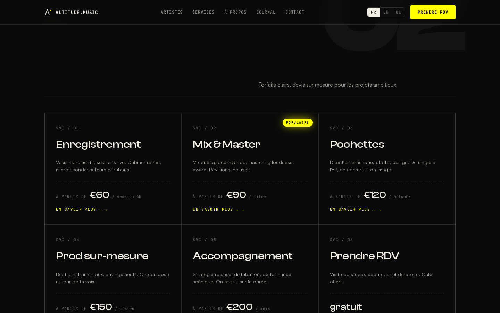
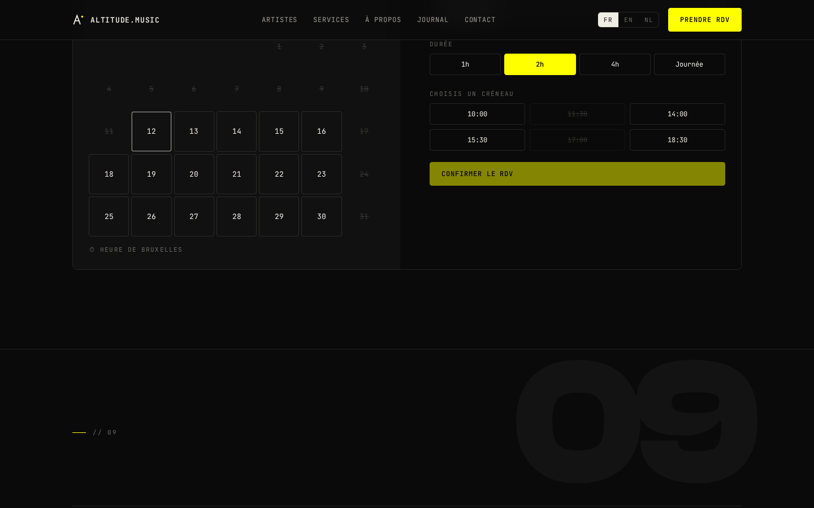

Altitude.Music est un studio d'enregistrement et un label d'artistes émergents basé à Louvain-la-Neuve. Le site sert à la fois de vitrine marketing et de surface de réservation : un visiteur doit pouvoir écouter un morceau en deux clics, comprendre l'offre en dix secondes et confirmer une session sans quitter la page.



## Le problème

Un studio d'enregistrement vend de l'écoute : si le visiteur n'entend rien dans les premières secondes, la visite est perdue. Il fallait aussi que l'équipe du studio puisse faire vivre le site elle-même — ajouter un morceau au portfolio, publier dans le journal, mettre à jour un témoignage — sans repasser par un développeur à chaque fois. Le tout sans backend à héberger ni à maintenir.

## Contraintes

- **Zéro backend.** Hébergement statique sur Netlify : pas de serveur, pas de base de données, rien à maintenir côté infra.
- **Contenu éditable par le studio.** Morceaux, journal, témoignages et services doivent se modifier sans toucher au code.
- **De l'audio réel sans API au runtime** — pas de credentials Spotify à gérer en production.
- **Trois locales** (`fr`, `en`, `nl`) avec un SEO complet par langue.
- **Performance mobile d'abord** : le public cible (artistes émergents) navigue essentiellement sur téléphone.

## Architecture

Site Astro 6 statique (SSG) déployé sur Netlify. La stratégie de rendu sépare volontairement les composants `.astro` statiques et les îlots React, hydratés uniquement quand c'est nécessaire :

```
.astro (zéro JS)      →  Nav, Hero, Marquee, Services, À propos, Journal, Footer
.tsx client:visible   →  Portfolio, Vidéos, Témoignages, Réservation, Contact
.tsx client:idle      →  Widget WhatsApp flottant
.tsx client:load      →  Modale service (écoute hashchange dès le premier rendu)
```

La majorité de la page d'accueil n'envoie aucun JavaScript. Les sections interactives ne se chargent qu'à l'entrée dans le viewport, ce qui garde un Time to Interactive serré sur mobile.

## Portfolio & Lecteur Now-Playing

La section portfolio s'alimente d'une collection de contenu — un fichier Markdown par morceau, trié par un champ `sortOrder` en frontmatter. L'îlot React gère le filtre par genre, la simulation de lecture et une barre sticky qui suit l'utilisateur dans le défilement.



Un script Node (`npm run sync:music`) récupère les URL de prévisualisation Spotify dans le frontmatter des Markdown, pour que le lecteur diffuse du vrai audio sans appel API au runtime.

## Services & Tarification

Les descriptions de services vivent dans `src/data/services.ts` plutôt que dans les fichiers JSON i18n — il s'agit de prose longue, fortement liée à l'identité de chaque service, ce qui simplifie l'édition par locale sans polluer les chaînes UI. Chaque service ouvre une modale routée par hash d'URL (`#service/<key>`), donc les liens profonds survivent à un reload.



## Agenda de Réservation

Un calendrier hydraté côté React permet de choisir une date, une durée (1h / 2h / 4h / journée) et un créneau horaire. Les réservations se synchronisent avec l'agenda du studio — le visiteur confirme la session en trois clics, sans quitter la page d'accueil.



## i18n & SEO

Trois locales (`fr`, `en`, `nl`) avec `prefixDefaultLocale: true` — chaque page vit sous son préfixe de langue et la racine redirige vers `/fr/`. Le layout émet l'URL canonique, les alternates hreflang dont `x-default`, et un bloc JSON-LD `MusicRecordingStudio`. L'intégration sitemap génère automatiquement un sitemap par locale pour `fr-BE`, `en-BE` et `nl-BE`.

## Hébergement

Le site se build en fichiers statiques et part sur Netlify à chaque push sur `main`. Pas de backend, pas de base de données, pas d'edge functions — le calendrier se branche sur le système de réservation existant du studio et le formulaire de contact passe par un endpoint d'email transactionnel.

## Édition de contenu par le studio

Le site embarque **Sveltia CMS** branché sur les six collections de contenu (morceaux, journal, témoignages, services…). L'équipe du studio édite ses contenus depuis le navigateur ; chaque sauvegarde est un commit Git qui déclenche un rebuild Netlify. Le studio est autonome sur son contenu, et le site reste 100 % statique — pas de base de données apparue en cours de route.

## Ce qui a été livré

- 41 jours entre le premier commit et la production (30 avril → 9 juin 2026)
- 11 morceaux dans le portfolio avec audio réel, 6 services, 5 témoignages, 3 locales
- Une dizaine de dépendances runtime seulement ; la majorité de la page d'accueil part sans JavaScript
- Assets hashés servis en cache immutable d'un an
- Sveltia CMS opérationnel sur les 6 collections — le studio publie sans développeur

## Leçons

- **Le contenu critique n'a rien à faire dans un îlot.** Les titres de section vivaient au départ dans les composants React : ils n'apparaissaient qu'à l'hydratation. Ils ont été remontés dans les `.astro` statiques — ce que le premier paint et les crawlers doivent voir doit être rendu serveur.
- **Le script de sync Spotify est un compromis assumé.** Il parse la page d'embed publique plutôt que l'API officielle : zéro credential à gérer, mais un HTML non contractuel qui peut casser. Acceptable parce qu'il tourne en local au moment d'ajouter un morceau — jamais au runtime, jamais en CI.
