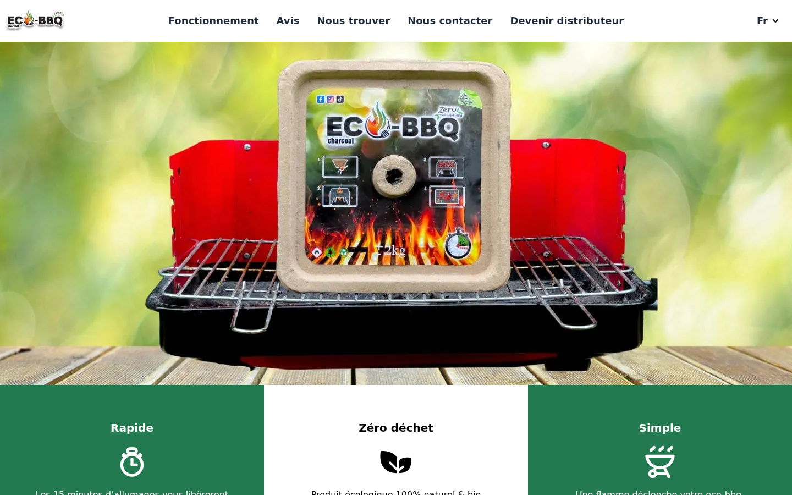
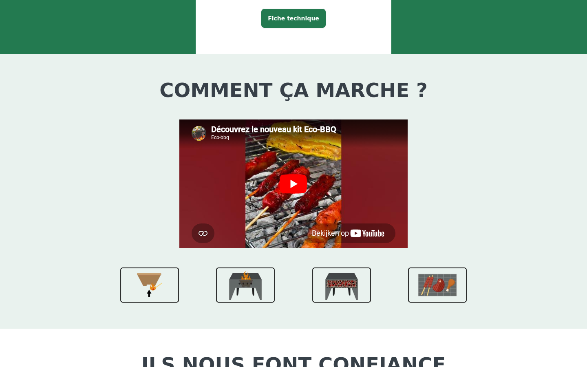
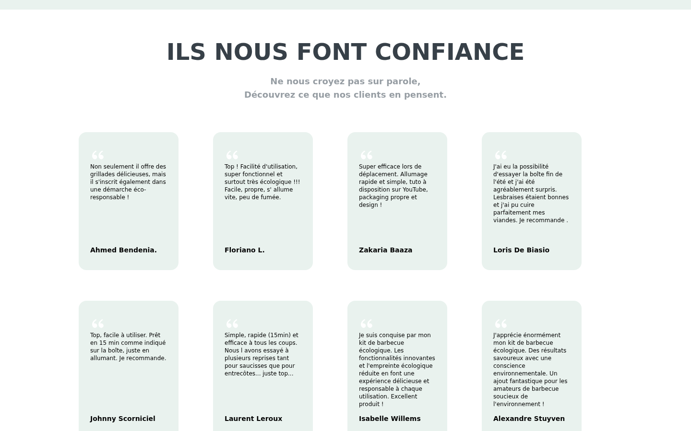
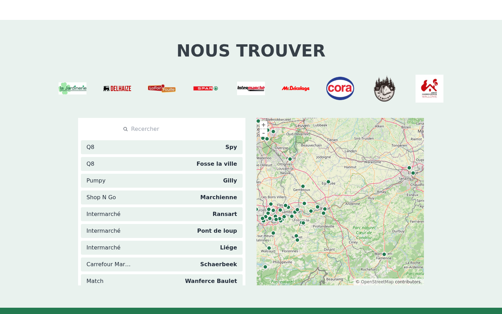

Eco-BBQ est un kit barbecue jetable zéro déchet distribué en Belgique, en France, en Espagne et au Portugal. Le site joue à la fois le rôle de vitrine grand public (comment ça marche, où l'acheter) et celui d'entonnoir B2B pour les revendeurs qui veulent référencer le produit. Trois locales, entièrement statique, hébergé chez Combell.



## Architecture

Astro 5 en mode entièrement statique avec Tailwind et DaisyUI pour le design system. La plupart de la page tient dans des composants `.astro` rendus serveur, sans JavaScript livré au client ; le seul îlot hydraté est la carte des revendeurs en **Svelte 5**, qu'il serait gaspilleur de bundler pour chaque visiteur qui passe à côté.

```
Composants .astro       →  Navbar, Hero, Bénéfices, Comment ça marche, Témoignages, Footer
Îlot Svelte 5           →  Carte revendeurs OpenLayers (Map.svelte)
Swiper 11 vanilla       →  Carrousel hero + carrousel témoignages
```

Swiper est chargé en bundle standalone pour les deux carrousels plutôt qu'enveloppé dans un framework — le coût runtime reste minimal et on évite de tirer React ou Vue juste pour piloter un slider.

## Comment Ça Marche

La section « comment ça marche » combine une vidéo explicative YouTube et une frise de quatre pictogrammes. Le contenu (titres, descriptions, illustrations) vient des modules `src/i18n/translatedContent/*.js`, donc éditer la copie ne demande pas de toucher au markup.



## Témoignages

Quatorze vrais témoignages clients sont rendus en grille statique sur desktop et en carrousel Swiper sur mobile. Chaque carte est du HTML rendu côté serveur ; le JS du carrousel ne s'attache que sous le breakpoint mobile, donc les visiteurs desktop ne le payent pas.



## Carte des Revendeurs

La section « Nous trouver » utilise **OpenLayers 8** pour afficher le réseau de revendeurs sur une carte interactive, avec une liste filtrable synchronisée à l'état de la carte. OpenLayers a été choisi plutôt que Google Maps pour garder la carte sans quota API ni cookie de tracking — le site n'affiche pas de bannière de consentement parce qu'il ne charge aucun tracker tiers sur la page d'accueil.



## i18n & Tunnel Partenariat

Trois locales (`fr`, `en`, `nl`) avec le préfixe français conservé (`/fr/`, pas la racine) pour garder une structure d'URL uniforme. Les slugs de route sont traduits par locale — `/fr/partenariat`, `/en/partnership`, `/nl/partnerschap` — gérés par une page dynamique `[lang]/[partnership].astro` avec un formulaire B2B branché sur Formspree. L'intégration sitemap génère automatiquement les entrées par locale.

## Hébergement

Build statique poussé sur l'hébergement mutualisé **Combell**. Pas de serveur, pas de base de données, pas d'API — le formulaire de contact part chez Formspree et le formulaire partenariat sur un autre endpoint Formspree, donc le site peut rester sur une infrastructure statique économique tout en captant des leads.
