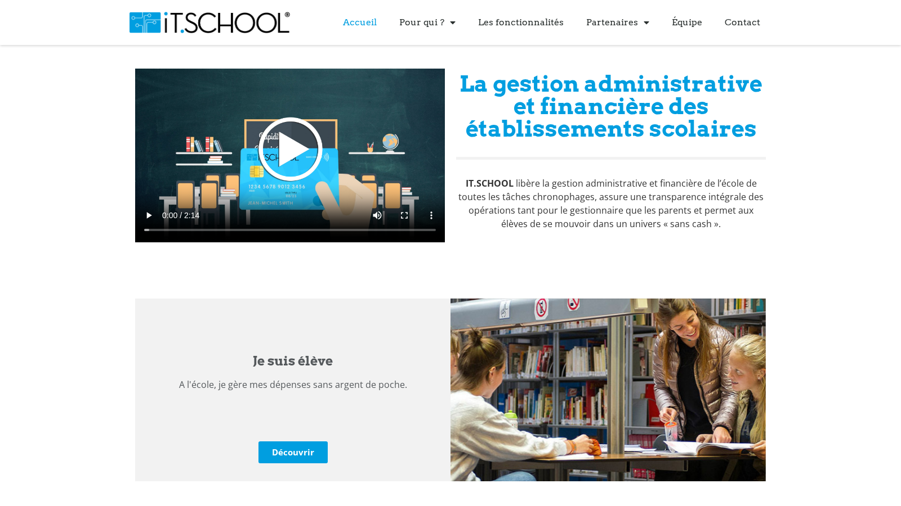
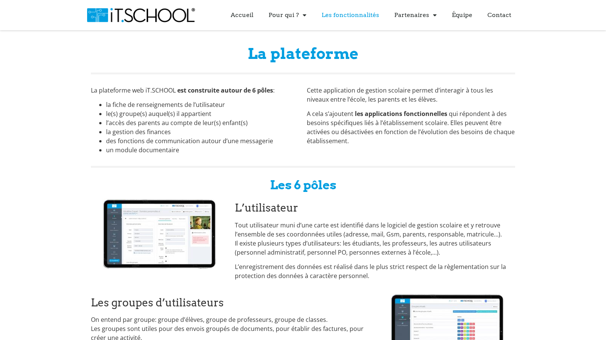

iT.SCHOOL est une plateforme SaaS éditée par Keyros SA, conçue pour libérer les équipes administratives des établissements scolaires belges des tâches de gestion financière chronophages. Chaque école dispose de son propre environnement hébergé (un tenant, une URL), avec des interfaces dédiées aux élèves, parents, directeurs et personnels administratifs.

> Les détails techniques de l'implémentation sont confidentiels et ne peuvent être divulgués.

## 6 pôles fondamentaux

**Utilisateurs** — Fiche complète par profil (adresse, email, GSM, parents, responsable, matricule) pour étudiants, professeurs et personnel administratif, dans le respect du RGPD.

**Groupes** — Organisation des élèves, professeurs et classes. Certains groupes se créent automatiquement (années, classes), d'autres manuellement ou par importation ProEco.

**Interface parents** — Portail sécurisé pour visualiser les dépenses, suivre les présences et retards, commander photos et manuels, inscrire à des activités, réserver des repas et payer les factures.

**Finances** — Portefeuille élève rechargeable par virement structuré ou paiement en ligne ; comptabilité centralisée (recettes, historique client) ; facturation avec suivi des impayés, rappels automatiques et frais de rappels.

**Messagerie** — Campagnes email vers élèves, professeurs et responsables avec pièces jointes ; suivi des ouvertures et dates de lecture.

**Documents** — Mise à disposition téléchargeable de factures, bulletins et communications, personnalisables par numéro de matricule.

## Modules optionnels

La plateforme propose également plus d'une dizaine de modules complémentaires :

- **POS (Point of Sale)** — Caisses physiques ou virtuelles illimitées, vente de livres, photocopies, jetons, statistiques et inventaire en temps réel
- **Réservation repas** — Réservation en borne ou via le portail parents avec paiement immédiat à la réservation
- **Distributeurs** — Système de badge pour achats immédiats, affichage du solde en temps réel, statistiques par machine et par produit
- **Présences / Retards** — Relevé en temps réel via tablette ou smartphone, notification automatique aux parents
- **Activités & Événements** — Inscription en ligne, gestion des paiements fractionnés (voyages), rappels automatiques
- **Prêt de manuels** — Commandes par classe/niveau, facturation automatique et notes de crédit en fin d'année
- **Garderie & Étude** — Enregistrement automatique des présences, facturation par créneau, attestations fiscales et relevés ONE
- **Réunion parents** — Prise de rendez-vous en ligne avec les professeurs, confirmation par mail, planning imprimable
- **Casiers** — Attribution, gestion des clés, caution et remboursement automatisés
- **Copieurs** — Débit direct sur le portefeuille élève, statistiques par machine, photocopies groupées par classe
- **Photos de classe** — Commande en ligne, facturation post-validation parent, gestion des retours

## Ma contribution

J'ai découvert ce projet lors d'un **stage**, puis poursuivi la collaboration en parallèle de mes études pendant **un an**. J'y interviens aujourd'hui en tant que **développeur freelance complémentaire**.

Au cours de cette collaboration, j'ai :

- Développé **deux modules fonctionnels** intégrés à la plateforme principale
- Réalisé les **tests de l'application** pour garantir la fiabilité des flux critiques (paiements, gestion des accès, données élèves)
