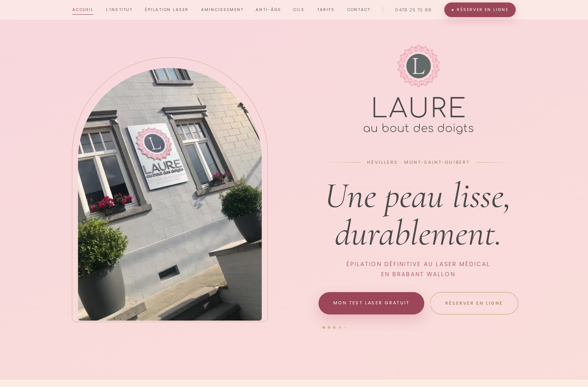
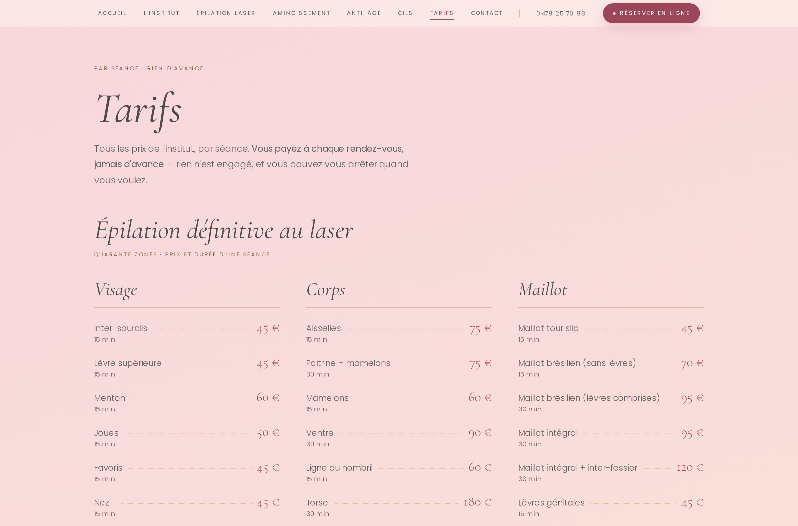
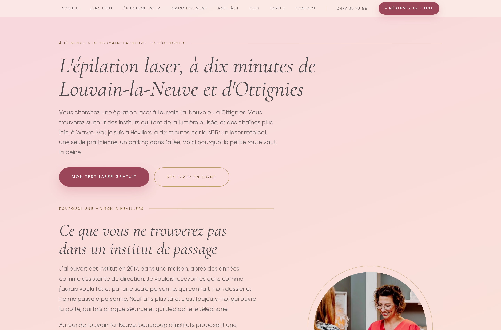

**Laure au bout des doigts** est un institut privé d'épilation définitive au laser médical, d'anti-âge du visage et d'amincissement, installé dans une maison à Hévillers (Mont-Saint-Guibert, Brabant wallon). Une seule praticienne, depuis 2017. Le site précédent, sur Wix, pesait 4,6 Mo et mettait près de six secondes à afficher son contenu sur mobile. Le nouveau pèse neuf fois moins et vise enfin les recherches que les gens tapent réellement.



## Le problème

L'ancien site n'était pas seulement lent, il était **invisible pour les bonnes recherches**. Le relevé des sept pages publiques, début septembre 2026, donnait :

- **Aucune balise `<h1>`** sur l'ensemble du site. Wix affichait des titres visuellement, sans jamais les baliser comme tels.
- La **même description meta** répétée de page en page.
- Des titres et des adresses construits autour du **nom du fabricant de l'appareil** — un terme que personne ne cherche — plutôt qu'autour de « épilation laser » et d'un nom de ville.

Et un piège qu'il fallait écarter d'emblée avec la cliente : **Lighthouse donnait 100 en SEO à l'ancien site.** Ce score ne mesure que la présence des balises, jamais leur utilité. Il ne départageait pas les deux sites, alors qu'il aurait suffi à conclure que « le SEO est déjà bon ».

## Contraintes

- **Personne ne cherche « épilation laser Hévillers ».** Le village est minuscule. La demande vit à Wavre, Louvain-la-Neuve, Ottignies, Gembloux — et il fallait aller la chercher sans mentir sur l'adresse.
- **Une seule praticienne**, qui ouvre la porte, fait les séances et répond au téléphone. Le site devait vendre exactement ça, pas simuler une clinique.
- **Pas de photographies professionnelles** au lancement. La direction artistique devait tenir sans elles.
- Budget et délai d'un indépendant : le site est passé de la première maquette à la production en **dix-neuf jours**.

## Ce que j'ai construit

Un site statique **Astro 7 + Svelte 5**, généré au build, déployé sur Netlify. Dix-huit pages, dont trois générées depuis une route dynamique.

Tout le contenu vit dans `src/data/` en TypeScript typé — quarante zones d'épilation avec prix et durée, la FAQ, les avis, les trajets — plutôt que dans le balisage. La cliente change un prix à un seul endroit.

**Le cœur de la stratégie, ce sont les pages de localité.** Trois villes, choisies sur une analyse de la concurrence réellement présente en première page : Ottignies et Louvain-la-Neuve (aucun centre laser dédié), Gembloux (aucun centre sur place), Wavre (trois centres installés — on peut passer devant les annuaires, pas devant eux).

Le piège évident aurait été de dupliquer une page en changeant le nom de la ville. Google filtre ces *doorway pages*. Chacune raconte donc ce qui change **pour la personne qui vient de là** : la route et le parking, ce qu'elle trouve déjà chez elle, et l'argument qui répond à cette situation précise. Et le titre dit toujours « près de », jamais « à » : l'institut est à Hévillers, et la page le répète.

```ts
// src/data/localites.ts — une entrée par ville, jamais un gabarit dupliqué.
// Les minutes viennent de `trajets`, les itinéraires sont lus sur la carte.
{
  cle: 'ottignies-louvain-la-neuve',
  titre: "L'épilation laser, à dix minutes de Louvain-la-Neuve et d'Ottignies",
  trajet: { porte: 'N25', minutes: 10 },
  // ce qu'elle trouve déjà sur place — l'argument découle de là
  histoire: 'lumière pulsée autour de LLN, chaînes plus loin à Wavre',
}
```

Côté interactivité, trois îlots Svelte seulement, hydratés à l'entrée dans le champ de vision : un simulateur de prix par zone, le formulaire de test laser gratuit, et le carrousel d'avis. **Cinq des six pages principales ne livrent aucun JavaScript de framework.**



## Ce qui a été livré

Mesures Lighthouse, mobile simulé, comparées sur la même page :

| | Ancien (Wix) | Nouveau (Astro) |
|---|---|---|
| Performance | 45 | 92 – 100 |
| Contenu principal affiché | 5,7 s | 1,8 – 2,9 s |
| Blocage du fil principal | 2 140 ms | 0 ms |
| Poids de la page | 4 631 Ko | 526 Ko |

- **Poids divisé par 8,8**, contenu principal affiché deux à trois fois plus tôt.
- **2 140 ms de blocage ramenés à zéro** : plus de taps ignorés ni de défilement saccadé sur mobile.
- Dix-huit pages avec un `<h1>` unique, une description propre à chacune, et des adresses qui portent le mot recherché.
- 146 commits en dix-neuf jours.

Le dépôt ne contient pas que le site : la charte graphique, cinq itérations de maquette, l'analyse du marché local avec les prix et les appareils des concurrents, et le plan d'acquisition que le site est censé servir.



## Leçons

**Un score parfait peut être le pire des diagnostics.** Les 100/100 SEO de l'ancien site auraient clos le sujet. Il a fallu ouvrir le HTML page par page pour voir qu'il n'y avait pas un seul `<h1>`. Un indicateur qui ne sépare pas deux situations opposées ne mesure rien d'utile — et coûte cher quand on lui fait confiance.

**La vraie difficulté n'était pas technique.** Porter une maquette en Astro est du travail connu. Décider *quelles trois villes* méritaient une page, et écrire trois textes réellement différents plutôt qu'un gabarit dupliqué, a pris plus de temps que le développement.

**Ce qui manque encore est le plus déterminant.** Le site est rapide et bien structuré, mais il lui manque des photographies professionnelles — et pour un institut de soins esthétiques, c'est probablement ce qui convertit le plus. Un site techniquement irréprochable ne compense pas une absence d'images.
