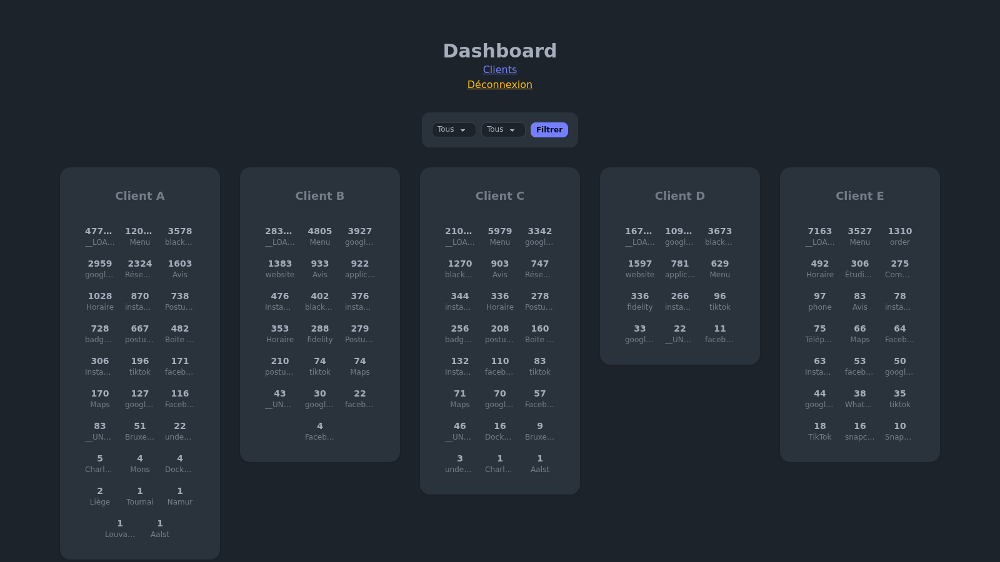

Holmes is de eigen analytics-service van het Carder NFC-kaartjesplatform. Het biedt een publiek `POST /api/hits/:client_id/:action_id`-endpoint dat door elke kaartpagina wordt gebruikt om views en klikken op links of badges bij te houden — zonder cookies, zonder scripts van derden.


## Architectuur

De applicatie is volledig geschreven in **Go 1.23**. De structuur volgt een klassieke gelaagde opbouw, samengebonden via dependency injection met **Uber fx**.

```
main.go  (fx.New → DI container)
    │
    ├── Config      (Viper — app.env + cors.yaml)
    ├── Database    (GORM + SQLite)
    ├── Service     (bedrijfslogica)
    ├── Middleware  (sessiebeheer: admin / klant)
    └── Handler     (Echo routes)
```

HTML-templates worden gegenereerd met **Templ** — een compiler die `.templ`-bestanden omzet naar getypeerde Go-functies, zonder stringaaneenschakeling en zonder `html/template` tijdens de uitvoering.

## Hit-tracking

De kern van de service is een minimale upsert:

1. `UPDATE Views SET Count = Count + 1 WHERE client_id = ? AND action_id = ? AND month = ? AND year = ?`
2. Als `RowsAffected == 0`, wordt een nieuwe rij `INSERT`-ed met `Count = 1`

Elke rij is gekoppeld aan `(client_id, action_id, month, year)`. Leesquery's aggregeren met `SUM(Count) GROUP BY client_id, action_id` om totalen over een periode samen te voegen.

## Dashboard



Twee toegangsniveaus beveiligd via **Gorilla Sessions**:

- **Admin** — globaal overzicht van alle clients, gesorteerd op aflopend hitvolume
- **Klant** — beperkte weergave tot de slugs die aan het ingelogde account zijn gekoppeld

Het maand/jaar-filter in het dashboard is een htmx-boosted formulier: gedeeltelijk herladen vermijdt een volledige paginaverversing zonder extra JavaScript.

## Configuratie

Toegestane CORS-origins worden gedeclareerd in `config/cors.yaml`, hot-reloaded via **Viper** + `fsnotify`. Geheimen (adminwachtwoord, cookiesleutel) worden ingeladen vanuit een `app.env`-bestand bij het opstarten, met een expliciete panic als `COOKIE_SECRET` ontbreekt.

## Deployment

Het Docker-image draait op hetzelfde Swarm-netwerk als Carder, achter **Caddy** (`holmes.nsmobile.be`). De SQLite-database wordt bewaard in een bind-gemount `./database`-volume. Een **GitHub Actions**-pipeline bouwt en deployt het image automatisch bij elke push naar de hoofdbranch.
