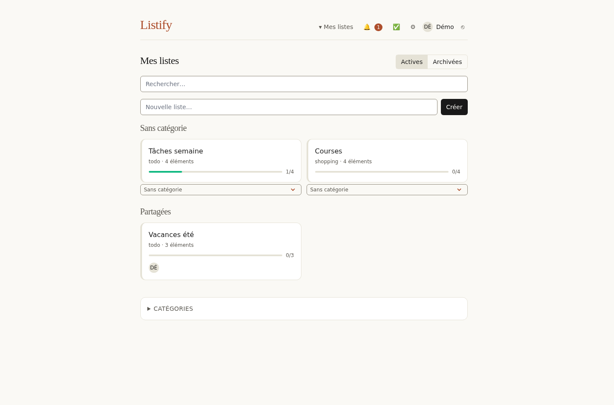
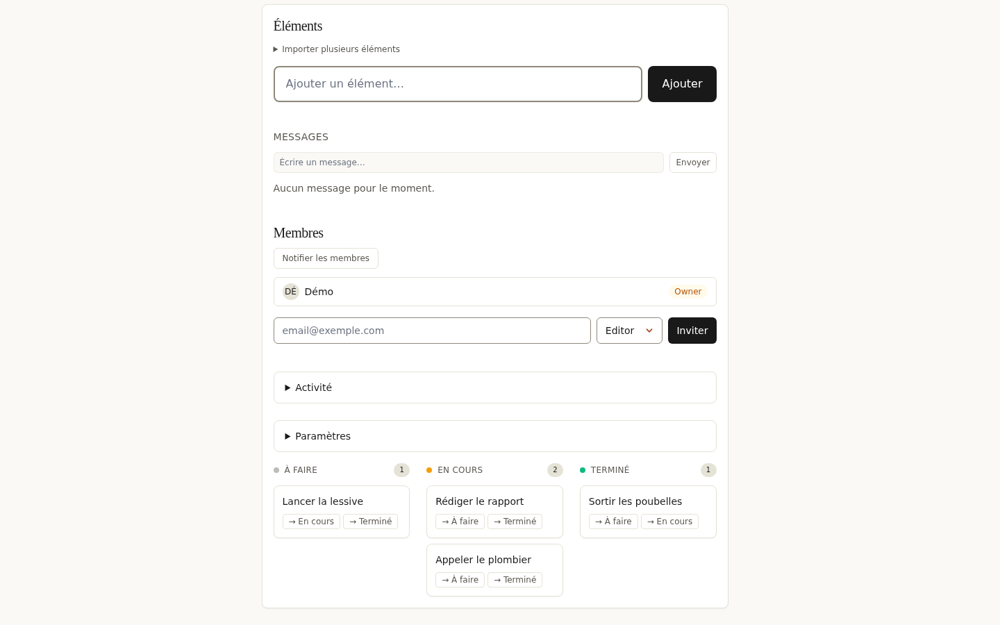

Listify is een app voor **realtime collaboratieve lijsten en kanban**: meerdere mensen bewerken dezelfde lijsten, zien wijzigingen meteen verschijnen en beheren leden, rollen en meldingen. Een greenfield-project gestuurd door een gedetailleerde specificatie, in productie en zelf gehost.



## Het probleem

Ik wilde een echt testterrein om de **Elixir/Phoenix/Ash**-stack te beproeven op een niet-triviaal domein: realtime samenwerking. Geen demo-todolijst, maar een volledige app — bewerkingsconcurrentie, rollen, uitnodigingen, meldingen, audit, GDPR — gestuurd door een spec die vóór de code geschreven werd, om de architectuurbeslissingen vooraf vast te leggen in plaats van te improviseren.

## Beperkingen

- **Realtime multi-user** zonder verloren conflicten en zonder verouderde payloads.
- **Architectuurbeslissingen bevroren in de spec** (v1.3/v1.4, genummerde secties): ordening, locking, job-queue-topologie.
- **Zelfhosting**: alles moet passen in een Docker Swarm-deployment zonder externe managed service.
- **GDPR-conformiteit** vanaf het begin (data-export, accountverwijdering).

## Architectuur

De app is 100% **Phoenix LiveView** — geen SPA-framework, de interactiviteit wordt server-gestuurd over WebSocket. Bedrijfslogica, persistentie en autorisatie verlopen allemaal via **Ash 3.4** (AshPostgres), georganiseerd in domeinen: `Accounts`, `Lists`, `Messaging`, `Notifications`, `Audit`, `Backups`, `Moderation`.

```
Phoenix LiveView (server-gestuurde UI)
    │
    ├── Ash-domeinen (logica, autorisatie, persistentie)
    │      Accounts · Lists · Messaging · Notifications · Audit · Backups
    ├── Phoenix PubSub (realtime signalering)
    ├── Oban (jobs: mailer, exports, scheduled, critical)
    └── PostgreSQL 16 + Redis (sessies)
```

## Realtime: signalering, geen payload

Elke item- of lijstmutatie publiceert een bericht op een PubSub-topic (`items:list:<id>`). Maar het kernpunt: de LiveView **gebruikt de uitgezonden payload niet** — ze ontvangt een eenvoudig signaal (`{:item_updated, id}`) en **herleest de volledige resource** via Ash, met autorisatie en policies toegepast. PubSub is een signaleringsmechanisme, geen datatransport — wat de hele klasse van "verouderde payload"-bugs elimineert.

## Selectieve optimistic locking

Gelijktijdige itembewerkingen worden bewaakt door een `lock_version` die **atomair in de SQL WHERE-clausule** wordt gecontroleerd (niet na het lezen — dus geen race). Een conflict geeft een 409 met de serverversie terug zodat de client opnieuw kan ophalen. Maar alleen de "zware" velden (titel, beschrijving, labels) worden bewaakt; hot velden (status, rang, toewijzing) verlopen via aparte *last-write-wins*-acties om snel te blijven. Dit is geen pessimistic locking — het is gerichte conflictdetectie.



## LexoRank-ordening

Itemordening gebruikt **LexoRank** (rang-strings) in plaats van gehele posities: herordenen voegt een rang *tussen* twee buren in O(1), zonder ooit te hernummeren of een globale sequentie te vergrendelen. Twee gelijktijdige herordeningen coördineren niet — de bit-string-wiskunde garandeert monotoniciteit.

## Achtergrondjobs (Oban)

Queue-topologie vastgelegd in de spec: `default` (10), `mailer` (5), `exports` (3), `scheduled` (2), `critical` (1). Een vijftiental workers: uitnodigings- en vermeldingsmails, deadline-herinneringen, dagelijkse digest, reset van terugkerende lijsten, GDPR-export, uitgestelde accountpurge, S3-backupopschoning.

## Wat er werd opgeleverd

- 33 dagen, 185 commits — **in productie** op `listify.josephpire.dev` (Docker Swarm, 2 replica's, rolling updates)
- Auth (AshAuthentication + bcrypt + magic links), realtime lijsten/items, owner/editor/viewer-rollen, uitnodigingen
- Meldingen (bel + toast), append-only auditlog, CSV-export, **REST API + OpenAPI/Swagger-documentatie**
- GDPR: data-export en accountverwijdering met respijtperiode; Web Push (PWA); S3-backups

## Lessen

- **Een spec die vóór de code wordt geschreven, legt de juiste beslissingen vast.** LexoRank-ordening, locking-strategie, Oban-topologie: één keer beslist, nooit halverwege opnieuw bediscussieerd.
- **PubSub als signaal, niet als transport.** Een id uitzenden en erachter herlezen via de autorisatielaag is één DB-round-trip trager, maar verwijdert datalekken en verouderde payloads — een waardevolle afweging.
- **Ash beloont nauwgezetheid.** Autorisatie modelleren in de resources in plaats van in de views vraagt vooraf discipline, daarna erft elk nieuw oppervlak (REST API, LiveView) het gratis.
