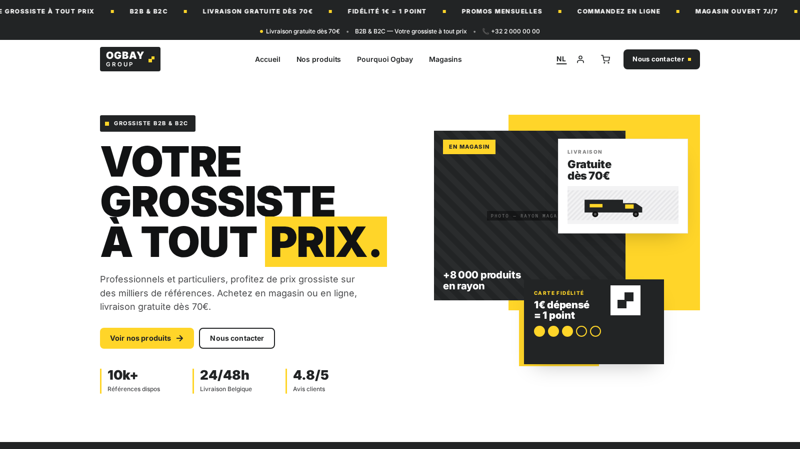
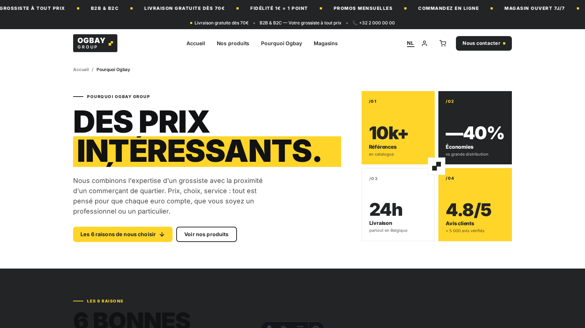
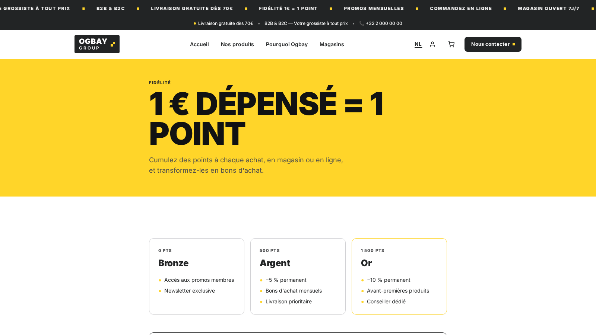

Ogbay is een multi-tenant platform voor bestelling- en productcatalogusmanagement, opgebouwd uit drie onafhankelijke applicaties achter een gedeelde Nginx reverse proxy.



## Architectuur

```
Nginx
  │
  ├── /api/*              → Symfony 7.4 via FastCGI (PHP-FPM :9000)
  ├── /.well-known/mercure → Mercure-hub (realtime WebSocket)
  ├── app.{domein}         → SvelteKit 2-dashboard
  └── /                   → Astro 6-winkel
```

Alle drie applicaties worden geörkestreerd door **Docker Compose** met omgevingsspecifieke overrides (`dev`, `test`, `staging`, `prod`). Een Makefile centraliseert alle gangbare operaties om direct aanroepen van docker compose te vermijden.

## Symfony 7.4 API

De REST API is georganiseerd per **bedrijfsdomein** in `src/Controller/`: Auth, Admin, Catalogue, Orders, Delivery, POS, Loyalty, Stock, Promo, Public. Dezelfde opdeling geldt voor de lagen `Service/` en `Repository/`.

De 29 Doctrine-entiteiten gebruiken **UUID's** als primaire sleutels. De belangrijkste:

- **Order** — volledige statusautomaat: aanmaken → bevestigen → voorbereiden → leveren → annuleren/terugbetalen
- **User** — meerdere rollen: klant, admin, chauffeur, POS-medewerker
- **DeliveryAssignment** — toewijzing van de chauffeur en statusopvolging
- **PosTicket / PosSession** — kassamodule voor bestellingen in de winkel
- **LoyaltyTransaction** — puntenspaarprogramma
- **StockMovement** — voorraadmutaties per product en winkel
- **PromoCode** — kortingscodes met geldigheidsregels

Authenticatie verloopt via **LexikJWT** (RSA-sleutelpaar) met refresh tokens. Transactionele e-mails (bevestiging, wachtwoordherstel) worden verstuurd via de **Brevo** API. PDF's (tickets, facturen) worden gegenereerd door HTML door te sturen naar de **Gotenberg**-sidecar.

## Realtime met Mercure

Statuswijzigingen van bestellingen worden gepubliceerd op de **Mercure-hub**. Het admindashboard en de chauffeurs-app ontvangen live updates via EventSource, zonder polling.

## Winkel (Astro 6)

De publieke winkel is gebouwd met **Astro 6 SSR** en **React 19**-eilanden voor interactiviteit. i18n-routing dekt Frans en Nederlands. De UI gebruikt **Tailwind 4 + DaisyUI 5**.





## Admindashboard (SvelteKit 2)

Het admindashboard is een full-SSR **SvelteKit 2**-applicatie op een eigen subdomein. Geneste routes, form actions, JWT-beschermd. Het dekt catalogusbeheer, realtime bestellingsbeheer, configuratie van bezorgslots, rapporten en gebruikersbeheer.

## Kwaliteit

De **PHPUnit**-testsuite draait in een geïsoleerde Docker-omgeving (`docker-compose.test.yml`) met een aparte database. Doctrine-migraties worden automatisch uitgevoerd bij het opstarten van de dev-container. **PHP-CS-Fixer** en **PHPStan** zijn geïntegreerd in de pipeline.
