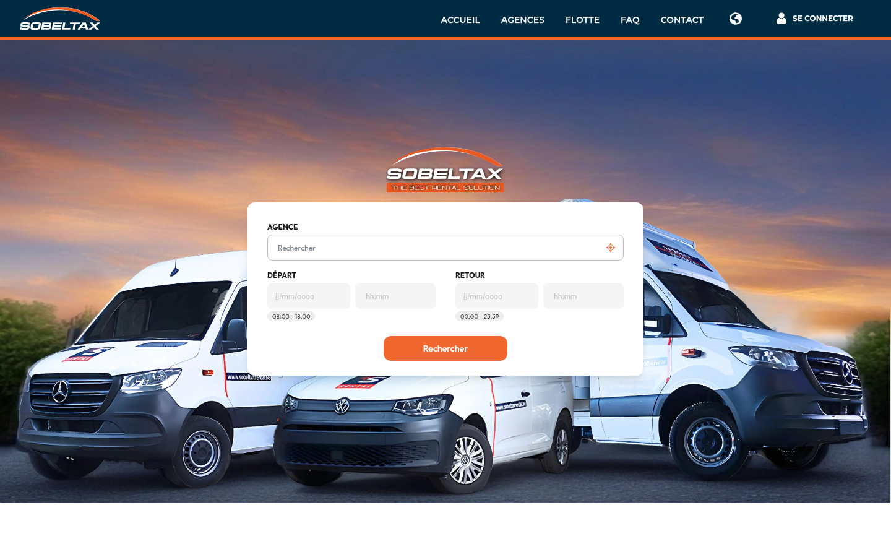
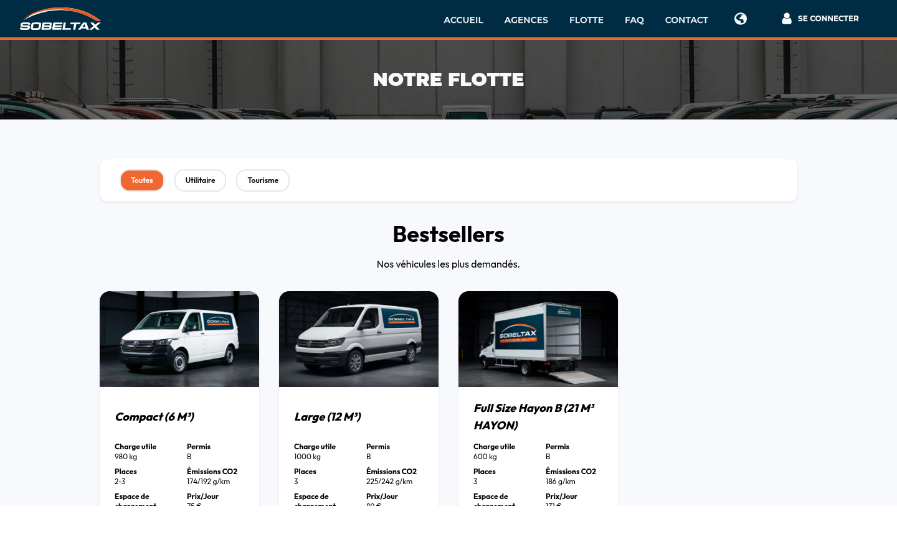
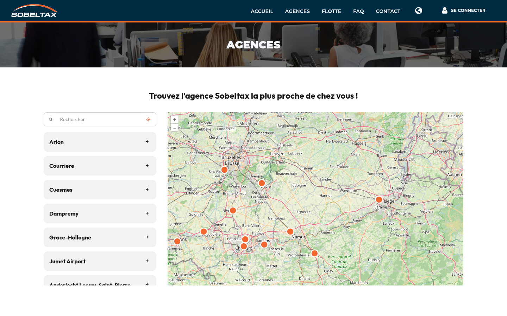

Sobeltax is een voertuigverhuursplatform voor de Belgische markt, beschikbaar in het Frans, Nederlands en Engels. De uitdaging was het leveren van een vlotte reserveringsflow, multi-agentuur beheer met kaartgebaseerde zoekopdracht en een volledig klantengebied — zonder afhankelijkheid van een monolithisch framework.



## Het probleem

De vorige site draaide op een legacy stack (door WebDev gegenereerde `.awp`-pagina's): moeilijk te laten evolueren, onmogelijk af te stemmen op het merk, en zonder echte online reserveringsflow. De bedrijfsdata — wagenpark, beschikbaarheid, agentschappen, klantaccounts — leefde al in het interne platform `platform.sobeltaxrental.be`. De nieuwe site moest dus een pure front-end zijn: geen lokale database, elke lees- en schrijfactie verloopt via de API van het platform.

## Beperkingen

- **Geen lokale database.** Het bedrijfsplatform blijft de enige bron van waarheid; de site gebruikt zijn API voor alles: beschikbaarheid, agentschappen, reserveringen, klantenzone.
- **Een API die ouder is dan de site.** Ze is niet ontworpen voor deze front-end — sommige data (met name voertuigfamilies en -categorieën) komt onvolledig binnen en vraagt mapping aan de front-kant.
- **Drie talen vanaf dag één** — `fr`, `nl`, `en`, voor de Belgische markt.
- **Gedelegeerde authenticatie**: sessies aan de site-kant, tokens vernieuwd tegen de platform-API via een dedicated middleware.
- **Betaling via callbacks** van een externe provider, geïntegreerd in de funnel zonder de state te breken.

## Architectuur

De applicatie is gebouwd met **Astro 5 in SSR-modus** met de Node.js-adapter, geserveerd door **Fastify 5** als HTTP-runtime. Interactieve componenten zijn **Svelte 5**-eilanden: elke pagina verstuurt alleen het JavaScript voor de componenten die ze daadwerkelijk gebruikt, zonder globale bundle. Dit verbetert de Time to Interactive direct, vooral op mobiel.

```
Fastify 5 (server.js)
    │
    ├── Middlewares: CORS, Helmet, statische bestanden
    │
    └── Astro SSR-runtime
            ├── .astro-pagina's (server-gerenderd)
            ├── Svelte-eilanden (gerichte interactiviteit)
            └── API-routes (acties, betalingscallbacks)
```

**Redis** slaat beschikbaarheidsdata van voertuigen en agentuurinformatie op in de cache, om herhaalde aanroepen naar externe diensten bij elke request te vermijden.

## Reserveringsflow in 5 stappen

De kern van de applicatie is een begeleide reserveringsprocedure:

1. **Datums en agentuur** — selectie via Pikaday en de OpenLayers-kaart
2. **Voertuigcategorie** — dynamisch filteren op basis van werkelijke beschikbaarheid
3. **Details** — bestuurdersinformatie, extra opties
4. **Verzekering** — dekking selecteren en valideren
5. **Bevestiging** — overzicht en betalingsstart

De reserveringsstatus wordt client-side bewaard met **Nanostores**, zodat gebruikers tussen stappen kunnen navigeren zonder ingevoerde gegevens te verliezen, ook na herladen van de pagina.



## Geolocaliseerde agentuurzoekopdracht

De agentuurpagina integreert **OpenLayers 10** voor een interactieve kaart van het netwerk. Zoeken werkt op naam of adres; de agentuurlijst synchroniseert in realtime met de kaart. OpenLayers werd gekozen als open source-alternatief voor Google Maps — geen quota, geen API-kosten.



## Belgisch meertalig

i18n-routing volgt het Astro-patroon: `/` voor Frans (standaardlocale, geen prefix), `/nl/` en `/en/` voor Nederlands en Engels. De locales `fr-BE` en `nl-BE` zijn gedeclareerd in de sitemap en metatags voor datum- en valuta-opmaak aangepast aan de lokale markt.

## Deployment

De applicatie draait op **Docker Swarm** met een dedicated productie-Compose-bestand. De Fastify-server luistert op poort 3000 achter een reverse proxy. Een multi-stage build scheidt ontwikkelingsafhankelijkheden van productie-artefacten voor een slanke uiteindelijke image.

## Wat er werd opgeleverd

- 66 pagina's en 53 componenten, over 3 locales
- Reserveringsfunnel in 5 stappen, volledige klantenzone, 14 agentschappen op de kaart, 10 voertuigfamilies
- Ongeveer 560 commits over 17 maanden (januari 2025 → mei 2026) — het project is in productie en wordt nog actief onderhouden
- Redis-sessies met een TTL van 7 dagen, server-side beschikbaarheidscache

## Lessen

- **Een API die je niet beheert, codeer je defensief.** Het vernieuwen van tokens leverde zijn deel randgevallen op, en de onvolledige API-data dwong een hardgecodeerde mapping van voertuigcategorieën af aan de front-kant — een werkbaar compromis, maar één dat bij elke wijziging van het wagenpark onderhouden moet worden.
- **Valideer vroeg, tegen echte gevallen.** De validatie van Belgische btw-nummers leidde tot meerdere correcties achteraf; realistische testdata vanaf het begin was goedkoper geweest.
- **Redis tussen de SSR en de API verandert alles.** De beschikbaarheidscache houdt pagina's snel, zelfs wanneer het bovenliggende platform traag is — op een SSR-site die op een externe API steunt, is dat het verschil tussen een vlotte site en één die andermans latency erft.

