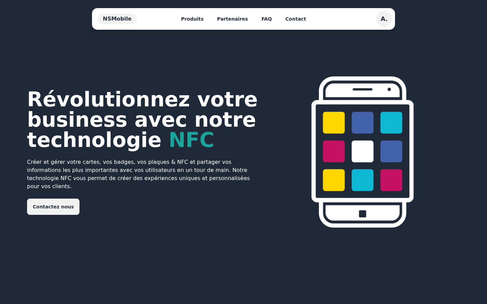
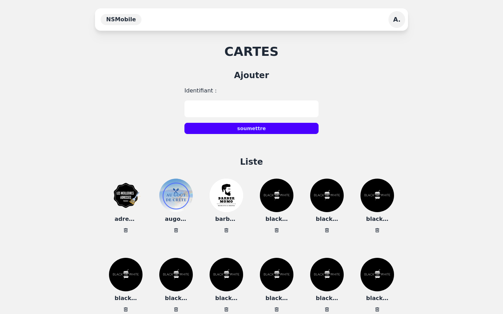
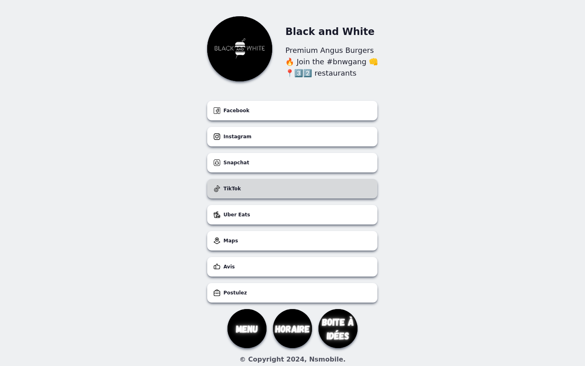

Tech Cards is een multi-tenant SaaS voor NFC-visitekaarten, uitgerold onder `nsmobile6k.be` en `techcard.be`. Elke klant krijgt een volledig aangepaste `/users/[slug]`-pagina — logo, kleuren, links, badges — bereikbaar met één tik van een NFC-smartphone.



## Architectuur

Gebouwd met **Astro 5 SSR** op de standalone Node.js-adapter. Persistentie via **Astro DB** (gehoste SQLite via libSQL), bevraagd met **Drizzle ORM**. Interactieve delen zijn **React 19**; de UI gebruikt **Tailwind + DaisyUI** voor basis-theming en inline CSS-variabelen voor de per-kaart kleuren. Mutaties lopen via **Astro Actions** in plaats van ad-hoc API-routes — type-safe van begin tot eind en gevalideerd door **Zod**.

```
Node.js (entry.mjs)
    │
    └── Astro SSR runtime
            ├── Publieke paginas   /users/[slug], /users/[slug]/badges/[id]
            ├── Gebruikersruimte   /cards, /cards/[slug]/edit, /profile
            ├── Admin-panel        /admin/cards, /admin/access
            └── Astro Actions      CRUD voor kaarten, links, badges, auth
```

Sessies gebruiken Astro's experimentele `fs-lite` driver, persistent gemaakt in een aparte Docker-volume.

## Productgamma

De publieke landing verkoopt vier fysieke NFC-dragers — plaques, tags, stickers en kaarten — allemaal gekoppeld aan hetzelfde kaart-record in het platform.


## Admin-panel

Admins maken slugs aan, beheren assets en ruimen de catalogus op vanaf één dashboard. Elke kaart heeft een eigen `/cards/[slug]/edit`-formulier waar de klant (of het bureau in zijn naam) alles hieronder configureert.



## Per-kaart aanpassing

Elke kaart heeft een set configureerbare eigenschappen:

- **Kleuren** — kaart-achtergrond, tekst, logo-achtergrond, link-kleur: allemaal als inline style geïnjecteerd voor een trouwe rendering zonder globale CSS te overschrijven.
- **DaisyUI-thema** — toegepast via `data-theme` voor licht/donker per klant.
- **Hoekradius** — `rounded` of `square` gestuurd door het `theme`-veld.

## Link-systeem

Een kaart toont maximaal **8 links** in een 2-koloms raster. Elke link is van één van 20+ types — telefoon, WhatsApp, Instagram, TikTok, Google Maps, Google-recensies, menu's, online bestellen, agenda, formulieren en meer. De `size`-eigenschap (`small` / `large`) bepaalt of de link 1 of 2 kolommen inneemt.

## Badges

Badges zijn visuele knoppen gekoppeld aan een afbeelding of logo, met een optionele URL of een dedicated subpagina op `/users/[slug]/badges/[id]`. Klanten gebruiken ze om certificaten, lopende promo's, een menu of rijke media direct op de kaart te tonen.



## Installeerbare PWA

Elke kaart-pagina genereert dynamisch een inline **Web App Manifest** — `id`, `start_url`, `scope`, themakleuren en iconen worden berekend uit het kaart-record. De eindgebruiker zet de kaart op het startscherm zonder via een store te gaan; de pagina start in `fullscreen`-modus zonder browser-chrome, wat de ervaring bij herhaalbezoeken niet te onderscheiden maakt van een native app.

## Cookieloze analytics

Bezoeken en kliks worden getrackt via een interne dienst (`holmes.nsmobile.be`). Elke event — page-load of klik op een link/badge — stuurt een `POST /api/hits/[slug]/[action]`. Geen cookies, geen third-party JavaScript, geen toestemmingsbanner nodig.

## Deployment

De applicatie draait op **Docker Compose** achter een **Caddy** reverse proxy, geconfigureerd via container-labels. Twee volumes worden gemount: `data/` voor sessies en de lokale SQLite-database, en `dist/client/assets/cards/` voor de kaart-assets (logo's, badges) die tussen image-rebuilds bewaard blijven.
